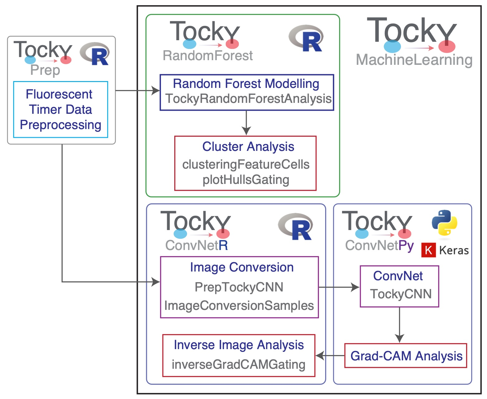
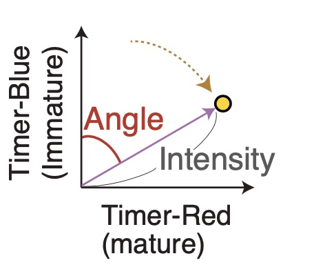

```{r, out.width = "25%", echo = FALSE}
knitr::include_graphics('assets/LogoTockyRandomForest.jpg')
```

## 1. Introduction to TockyMachineLearning Package Suite

The **TockyRandomForest** R package is part of the **TockyMachineLearning** package suite.

The **TockyMachineLearning** package suite comprises several subpackages designed to facilitate advanced machine learning analyses of flow cytometric data from Fluorescent Timer reporters. Each package within the suite specializes in different aspects of data handling and analysis:

- **TockyRandomForest**: An R package that provides Random Forest analysis tools specifically tailored for processing and interpreting Fluorescent Timer data.
  
- **TockyConvNetR**: An R package focused on data preprocessing and feature cell analysis suitable for Convolutional Neural Network (ConvNet) analyses. This package facilitates image conversion methods for preparing Tocky data and implements Inverse GradCAM Gating Analysis to interpret ConvNet/Grad-CAM outputs.

- **TockyConvNetPy**: A Python package dedicated to performing ConvNet training and conducting Grad-CAM analysis, complementing the R-based preprocessing and analysis tools.

Below is a schematic figure providing an overview of the workflows and interactions within the **TockyMachineLearning** suite.


```{r, out.width = "100%", echo = FALSE}

```

**Tocky** short for "Timer-of-cell-kinetics-and-activity," is inspired by the Japanese word "toki," meaning "time." It serves as a comprehensive toolkit that integrates experimental and computational approaches to analyze the temporal dynamics of cell differentiation and activation in vivo.

## 2. Principles of Tocky

### 2-1. The Use of Fluorescent Timer Protein for Investigating Cellular Dynamics

The concept of Tocky technology was conceived and created by Dr. Masahiro Ono. To measure time-dependent processes in individual T cells **in vivo**, Dr. Ono envisioned using a substance capable of encoding time information through its known kinetics. Through screening experiments, the mCherry mutant, Fluorescent Timer protein **Fast-FT**, originally developed by **the Verkhusha group** at Einstein (@Subach2009), emerged as an ideal candidate, particularly for its compatibility with flow cytometry.

Leveraging this feature, the Ono lab developed new Fluorescent Timer reporter transgenic mouse strains for analyzing T cell activities and differentiation *in vivo*. These new transgenic strains include the Nr4a3 Fluorescent Timer reporter mice for the Nr4a3 gene, which is downstream of T cell receptor signaling, and the Foxp3 gene, which is specific to regulatory T cells. To effectively analyze the data generated by the Tocky mice, Dr. Ono further developed data analytic concepts dedicated to Fluorescent Timer data, using the **Trigonometric Transformation method** for analyzing Fluorescent Timer data, as reported in 2018 (@Bending2018a). Consequently, the novel Fluorescent Timer systems for the analysis of temporal changes in molecular and cellular activities have been designated as Nr4a3-Tocky and Foxp3-Tocky.


The Fluorescent Timer protein undergoes a spontaneous and irreversible transition in its emission spectrum, shifting from blue to red fluorescence post-translation.

Our experimental measurements of fluorescence revealed that the half-life of Timer Blue fluorescence is approximately 4 hours, whereas the half-life of Timer Red fluorescence extends to about 120 hours (@Bending2018a).


### 2-2. Tocky Data Transformation

The primary objective of the Tocky approach is to analyze the time-related information captured in the profiles of Timer-Blue and Timer-Red fluorescence data at the individual cell level.

To optimally utilize this temporal information in single-cell analysis, we have introduced a novel concept along with appropriate algorithms. These tools are designed to normalize and transform Timer fluorescence data into two key metrics: *Timer Angle* and *Timer Intensity*.

{ width=30% align="center"}

*Timer Angle* is defined as the angle (in degrees, ranging from 0 to 90) measured from the Timer-Blue axis towards the Timer-Red axis. *Timer Intensity* represents the distance (or *norm*) from each cell to the origin (where Timer-Blue = Timer-Red = 0).

Normalized and **trigonometric-transformed** Timer fluorescence data offer opportunities to analyze *real-time* transcriptional activities and *cumulative* (historical) activities observed in the days leading up to the experimental analysis of cells, as demonstrated in our previous reports (@Bending2018a; @Bending2018b).


## 3. Data Preprocessing

Install and use [the **TockyPrep** R package](https://github.com/MonoTockyLab/TockyPrep) to preprocess flow cytometric Fluorescent Timer data (@TockyPrep2024).


## References
